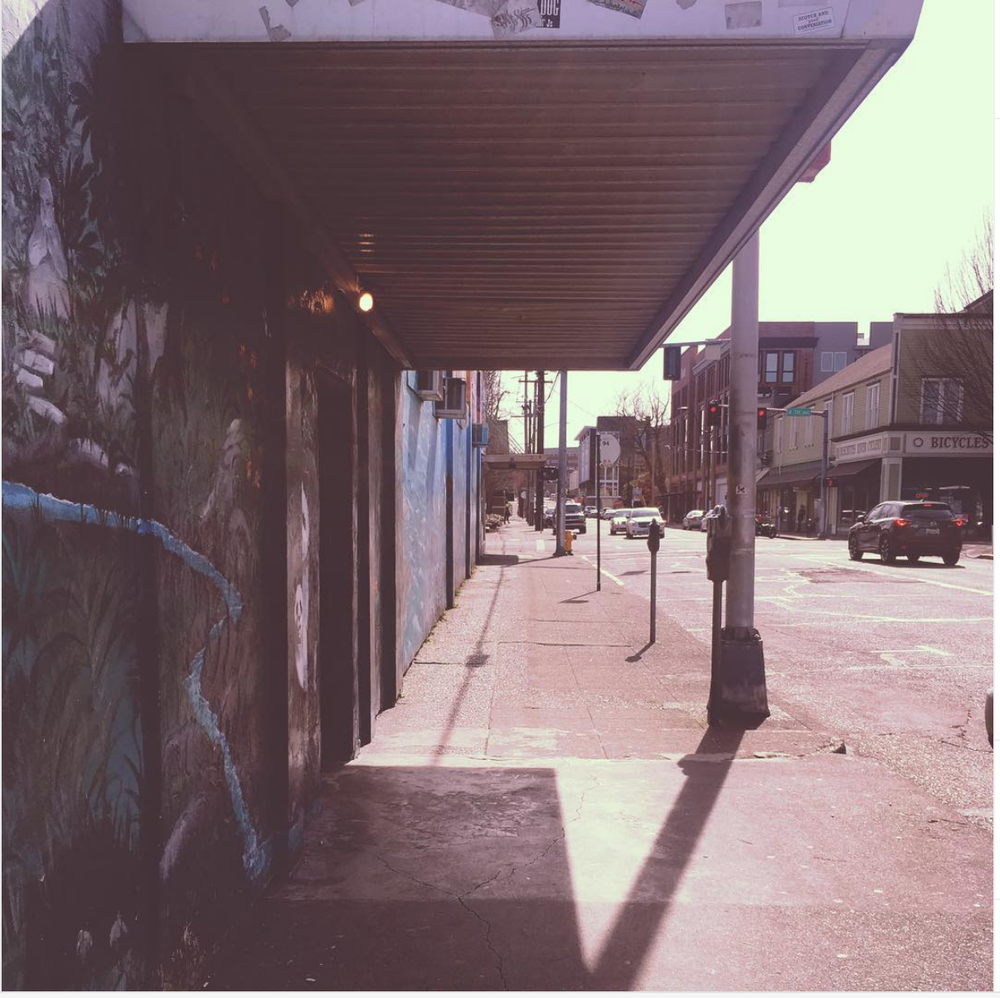
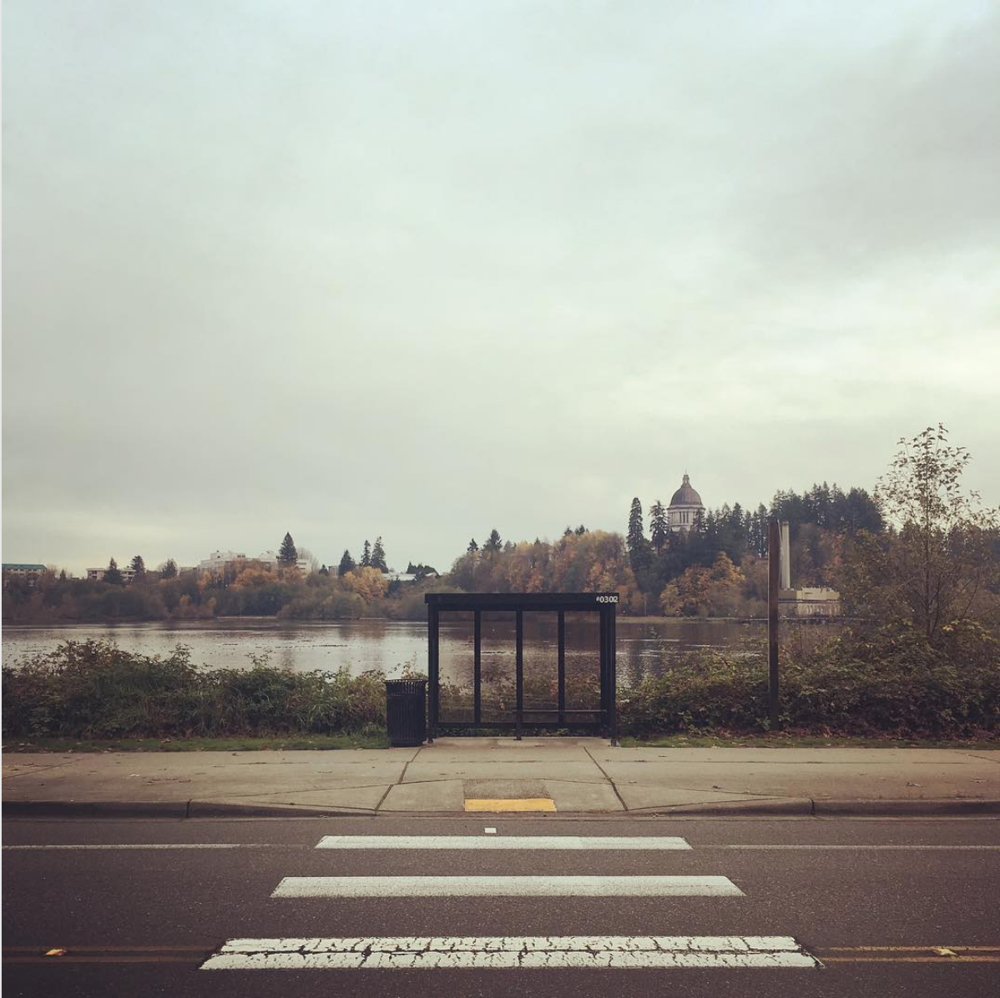
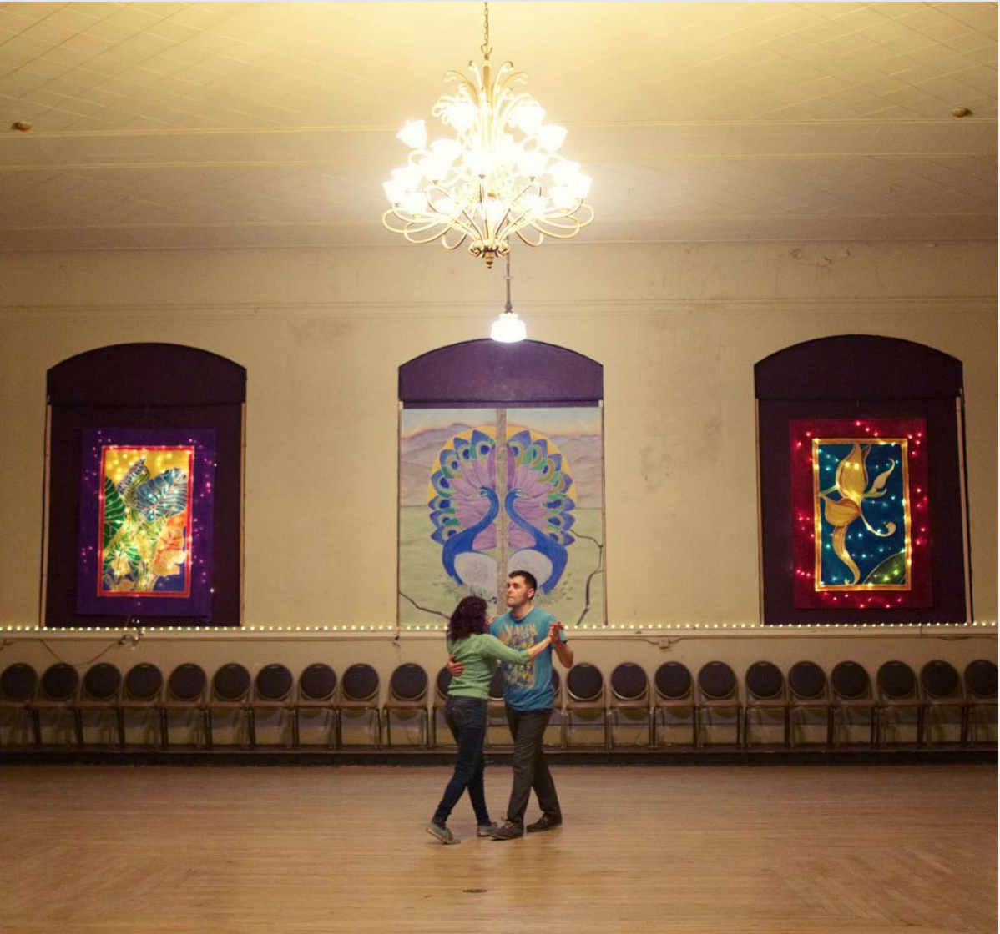
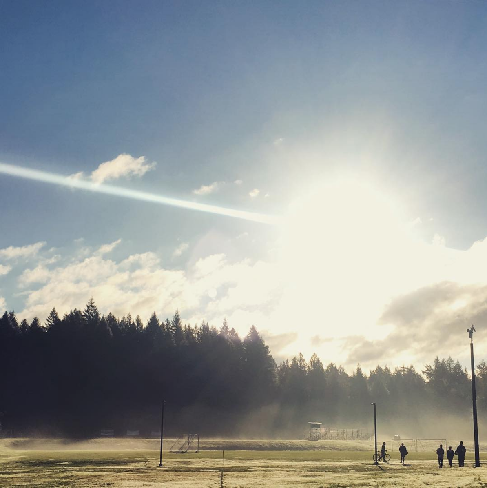
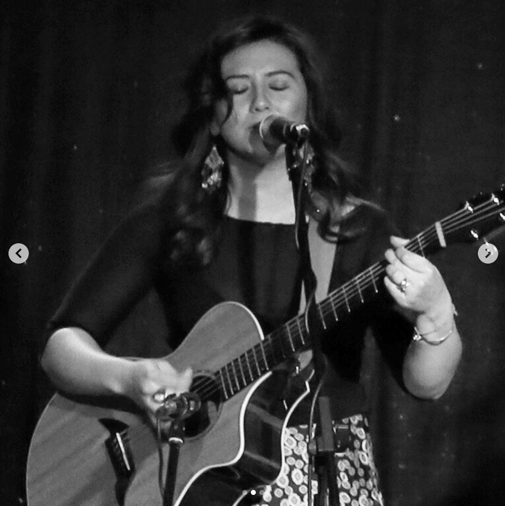
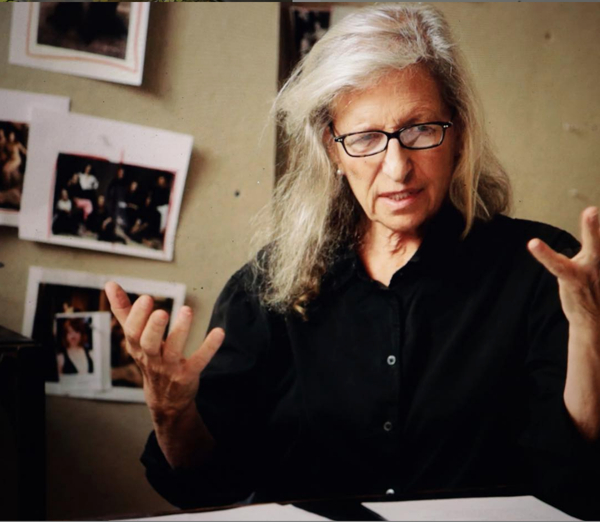
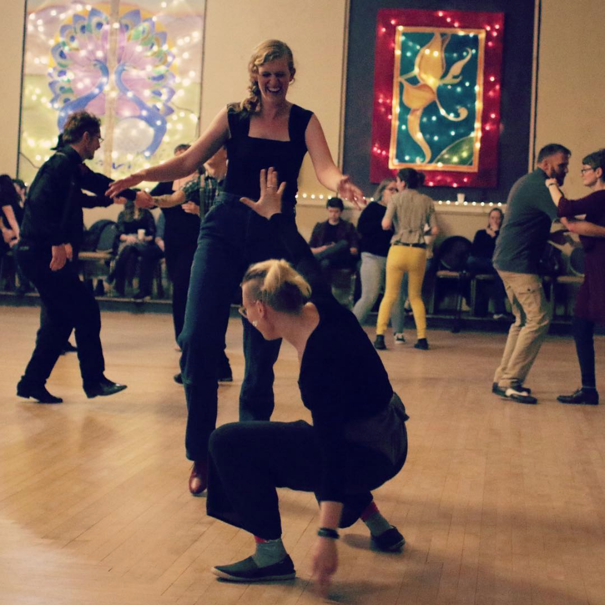
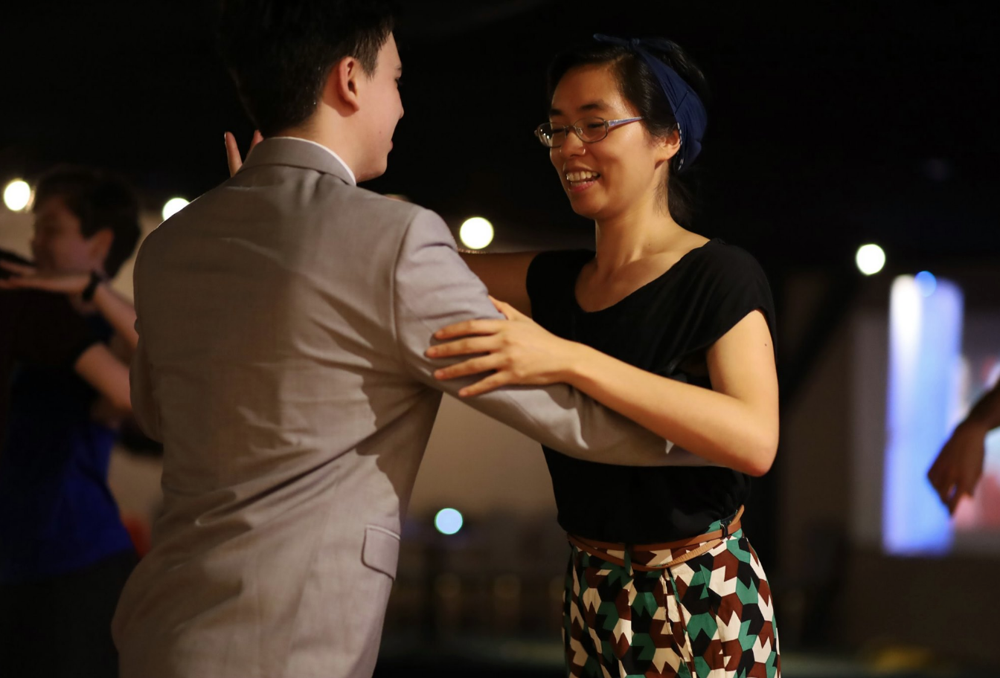
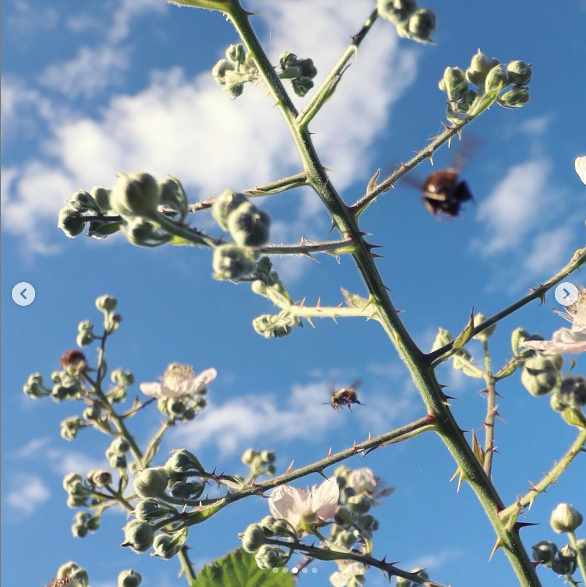
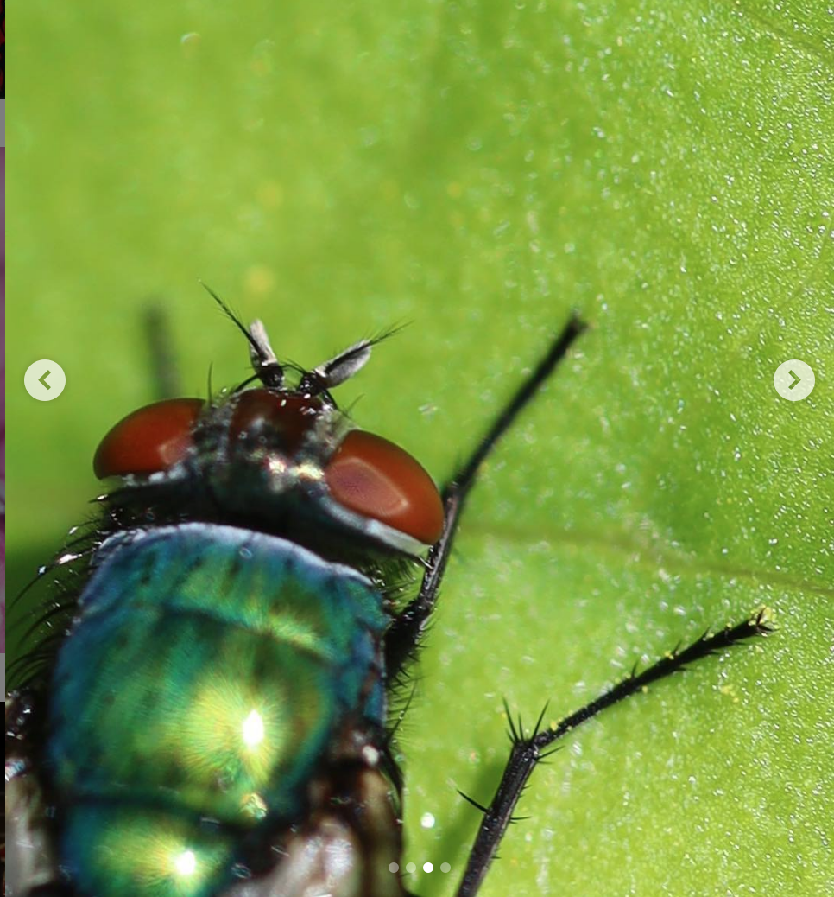

# Photography styles

## Straight shot
My most prominant photography style involves a straight shot. I would say this 
is an idiomatic example of the "shape" of this style:

  

  https://www.instagram.com/p/BvD-YjwnNjs/  

It looks like a hallway you're looking straight down. This lens angle comes up a lot. Here is another example:

  

  https://www.instagram.com/p/BbTbsOaFC6I/

The look comes in part from the camera being completely vertical, with the center of the hallway in the middle of the shot.

  

  https://www.instagram.com/p/Bt0Mc6snFvu/

## Small subject / big sky

The last photo (dancers) also involves another characteristic of a lot of my shots, 
and that is a small subject in the bottom half of the frame. For example:

  

  https://www.instagram.com/p/BoqYMu5Abp5/

I've purposefully started to avoid using the straight-shot style, to develop other ways of seeing, 
but I still like it and use it regularly.

## Portraits

I feel the styles above developed partially as a result of my camera / lens, 
the iPhone SE. With access to new lenses, I started to explore the things
they made it easier to do.

Largely, taking portraits has been about reading or empathizing with the
subject and trying to capture something real in there. I like trying 
to capture genuine facial expressions, whether subtle or dramatic.

  

  https://www.instagram.com/p/BwwRse0nuwd/

My subjects are mostly bands because they don't seem to mind getting
their photo taken, but I enjoy taking photos of most people:

  

  https://www.instagram.com/p/ByPPk9HlE3h/

## Dance

I am actively exploring how to take photos of dancing, adjusting lenses and approaches. 
I have a lot to say about dance, for another time, but like my portrait work, 
I try to capture genuine facial expressions in a positive light.

  

  https://www.instagram.com/p/BuVaT4GHLRA/

I feel that a lot of dance is about having fun with the mix of certainty and uncertainty in the moment,
and anyway here is a photo that I like:

  

## Novelties

Occasionally I do enjoy trying to capture novel perspectives that each
lens allows, but it is a lot of work and somewhat exhausting. 

We can do things like this:

  

  https://www.instagram.com/p/ByRUHXVFlSL/

Or:

  

  https://www.instagram.com/p/ByChvkhF5-Q/

## Storytelling

I am currently experimenting with storytelling through photography, both 
with sequences of photos and in the cropping / composition of each piece:

https://www.instagram.com/p/B0nCJ8fldft/
